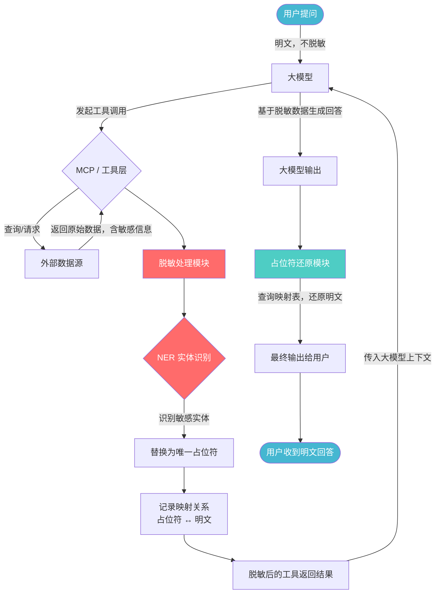
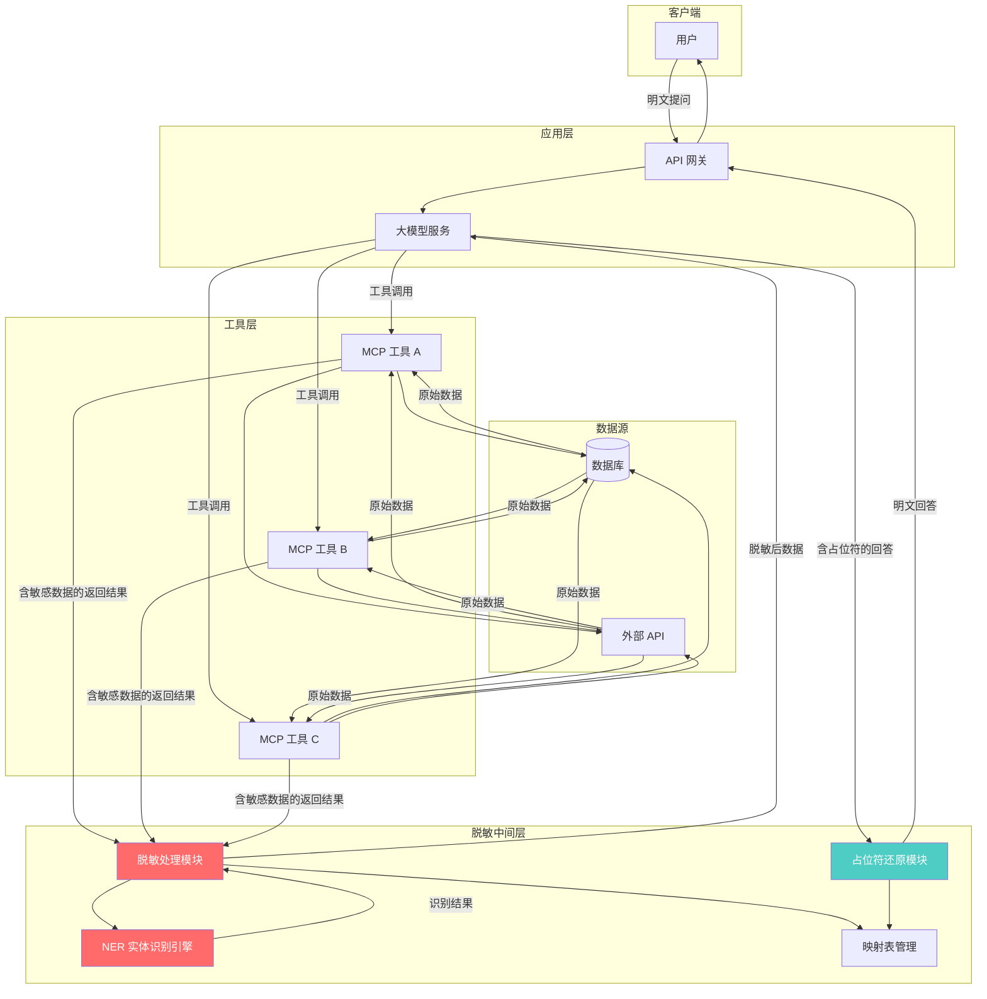

# MCP / 工具调用返回数据脱敏需求方案

## 一、需求背景

在企业级大模型系统对接场景中，用户提问通过大模型触发 MCP / 工具调用（如查询数据库、调用 API 接口），工具返回的结果中往往包含大量敏感数据（如手机号、身份证、姓名、地址等）。这些敏感数据直接进入大模型上下文后，存在数据泄露风险。

**核心诉求**：对 MCP / 工具调用返回的数据进行脱敏处理，确保敏感数据不以明文形式进入大模型上下文。用户提问本身保持明文，不做脱敏处理。

---

## 二、方案说明

**MCP / 工具调用返回数据脱敏**

- 用户提问明文不脱敏，保持自然交互体验。
- 工具返回数据在进入大模型前完成脱敏，确保敏感数据不进入模型上下文。
- 脱敏后的大模型回答通过占位符还原机制，将明文数据返回给用户。

---

## 三、整体流程

### 3.1 流程图



### 3.2 流程说明

| 步骤 | 说明 |
|------|------|
| 1. 用户提问 | 用户以明文方式提问，不做任何脱敏处理 |
| 2. 大模型解析意图 | 大模型理解用户需求，决定调用哪些工具/MCP |
| 3. 工具调用执行 | MCP / 工具层执行调用，从外部数据源获取原始数据 |
| 4. 工具返回原始数据 | 返回结果包含敏感信息（手机号、姓名、身份证等） |
| 5. 脱敏处理模块介入 | 在数据进入大模型上下文前，拦截工具返回结果 |
| 6. NER 实体识别 | 使用 NER 模型识别文本中的敏感实体（不使用正则） |
| 7. 替换为占位符 | 将识别到的敏感数据替换为唯一占位符 |
| 8. 记录映射关系 | 保存占位符与明文的双向映射（会话级别） |
| 9. 脱敏数据传入大模型 | 大模型仅看到脱敏后的数据，无法接触敏感明文 |
| 10. 大模型生成回答 | 基于脱敏数据生成包含占位符的回答 |
| 11. 占位符还原 | 根据映射表将占位符还原为明文 |
| 12. 返回用户 | 用户收到完整的明文回答 |

---

## 四、脱敏处理模块详细设计

### 4.1 敏感数据类型

敏感数据类型**来源于 HRLINK 系统的配置**，由 HRLINK 统一管理并下发，脱敏模块根据 HRLINK 的配置动态加载需要脱敏的数据类型，不在本地硬编码。

| 配置项 | 说明 | 示例 |
|--------|------|------|
| 数据类型编码 | HRLINK 中定义的唯一标识 | `PHONE`、`ID_CARD`、`NAME` 等 |
| 数据类型名称 | 可读的中文名称 | 手机号、身份证号、姓名 等 |
| 脱敏策略 | 该类型对应的脱敏方式 | NER 实体识别 |
| 占位符前缀 | 脱敏后占位符的类型标识 | `PHONE_001`、`NAME_001` 等 |

**配置管理要求**：

- 脱敏模块启动时从 HRLINK 拉取最新的敏感数据类型配置
- 支持配置热更新：HRLINK 侧新增或修改数据类型后，脱敏模块自动生效，无需重启
- 新增敏感类型时，只需在 HRLINK 系统中配置，无需修改脱敏模块代码

### 4.2 脱敏技术选型：NER 实体识别

**不使用正则表达式**，采用 NLP 实体识别（NER）方案。

#### 为什么选择 NER 而非正则？

| 对比项 | 正则表达式 | NER 实体识别 |
|--------|------------|--------------|
| 识别准确率 | 低，误匹配多 | 高，基于语义上下文 |
| 泛化能力 | 差，需穷举格式 | 强，可识别未见格式 |
| 维护成本 | 高，规则膨胀 | 低，模型自动学习 |
| 复杂场景 | 无法处理模糊表述 | 可处理上下文关联实体 |
| 新类型扩展 | 需手动编写规则 | 可通过标注数据快速扩展 |

#### 推荐 NER 模型

| 模型 | 特点 | 适用场景 |
|------|------|----------|
| BERT + CRF (中文) | 准确率高，上下文理解强 | 通用场景 |
| HanLP | 开箱即用，实体类型丰富 | 快速集成 |
| JioNLP | 轻量，专注信息抽取 | 资源受限环境 |
| 业务微调模型 | 针对业务数据训练 | 高准确率要求场景 |

### 4.3 占位符设计

占位符格式：`{TYPE}_{唯一ID}`

| 敏感类型 | 占位符示例 | 说明 |
|----------|------------|------|
| 手机号 | `PHONE_001` | 第1个识别到的手机号 |
| 身份证号 | `IDCARD_001` | 第1个识别到的身份证号 |
| 姓名 | `NAME_001` | 第1个识别到的姓名 |
| 邮箱 | `EMAIL_001` | 第1个识别到的邮箱 |
| 银行卡 | `BANKCARD_001` | 第1个识别到的银行卡号 |
| 地址 | `ADDRESS_001` | 第1个识别到的地址 |

**占位符规则**：
- 唯一 ID 在同一会话内递增，保证可还原
- 同一敏感值使用同一占位符，避免冗余
- 映射表仅在会话内有效，会话结束后销毁

### 4.4 脱敏处理流程


---

## 五、映射表管理

### 5.1 映射表结构

```
Session Mapping Table
├── session_id: "session_abc123"
├── mappings:
│   ├── PHONE_001 → "13812345678"
│   ├── NAME_001  → "张三"
│   ├── IDCARD_001 → "110101199001011234"
│   └── ADDRESS_001 → "北京市朝阳区XX路XX号"
├── created_at: "2025-06-11T10:00:00Z"
└── expires_at: "2025-06-11T10:30:00Z"  // 会话过期时间
```

### 5.2 映射表管理规则

| 规则 | 说明 |
|------|------|
| 会话隔离 | 每个用户会话独立维护映射表 |
| 自动过期 | 会话超时后自动销毁映射表 |
| 内存存储 | 映射表仅存于内存，不持久化 |
| 安全清理 | 会话结束后立即清除所有映射 |

---

## 六、脱敏示例

### 6.1 工具调用场景

**用户提问（明文）**：
> 帮我查一下张三的订单信息，他手机号是 13812345678

**工具返回原始数据**：
```json
{
  "order_id": "ORD20250611001",
  "customer_name": "张三",
  "phone": "13812345678",
  "address": "北京市朝阳区建国路88号",
  "order_amount": 2999.00,
  "status": "已发货"
}
```

**脱敏后传入大模型**：
```json
{
  "order_id": "ORD20250611001",
  "customer_name": "NAME_001",
  "phone": "PHONE_001",
  "address": "ADDRESS_001",
  "order_amount": 2999.00,
  "status": "已发货"
}
```

**大模型输出（含占位符）**：
> NAME_001 的订单 ORD20250611001 已发货，订单金额 2999 元，收货地址为 ADDRESS_001，联系电话 PHONE_001。

**还原后输出给用户**：
> 张三的订单 ORD20250611001 已发货，订单金额 2999 元，收货地址为北京市朝阳区建国路88号，联系电话 13812345678。

---

## 七、非功能需求

### 7.1 性能要求

| 指标 | 要求 |
|------|------|
| 脱敏处理延迟 | 单次脱敏 < 50ms |
| NER 识别准确率 | ≥ 95% |
| NER 识别召回率 | ≥ 98% |
| 映射表查询 | O(1) 时间复杂度 |

### 7.2 安全要求

| 要求 | 说明 |
|------|------|
| 数据不落地 | 映射表仅在内存中，不写入磁盘或日志 |
| 会话隔离 | 不同会话的映射表严格隔离 |
| 安全销毁 | 会话结束后立即清除映射数据 |
| 审计日志 | 脱敏模块的操作日志不记录明文敏感数据 |

### 7.3 可扩展性

| 要求 | 说明 |
|------|------|
| 自定义实体类型 | 支持通过配置添加新的敏感数据类型 |
| 模型热更新 | 支持在不重启服务的情况下更新 NER 模型 |
| 多工具适配 | 脱敏模块适配不同类型工具的返回格式（JSON、XML、纯文本等） |

---

## 八、技术架构总览



---

## 九、实施计划

| 阶段 | 内容 |
|------|------|
| 第一阶段 | NER 模型选型与评估 |
| 第二阶段 | 脱敏处理模块开发 |
| 第三阶段 | 映射表管理与还原模块开发 |
| 第四阶段 | 与现有 MCP / 工具层集成 |
| 第五阶段 | 测试与调优（准确率、性能） |
| 第六阶段 | 上线部署与监控 |

---

## 十、总结

本方案聚焦于 **MCP / 工具调用返回数据脱敏** 这一核心环节：

1. **用户提问保持明文**：不影响用户交互体验。
2. **工具返回数据脱敏**：采用 NER 实体识别技术（非正则），精准识别并替换敏感数据为占位符。
3. **占位符还原**：通过会话级映射表，在最终输出时将占位符还原为明文。
4. **安全保障**：敏感数据全程不进入大模型上下文，映射表内存级管理，会话结束即销毁。
