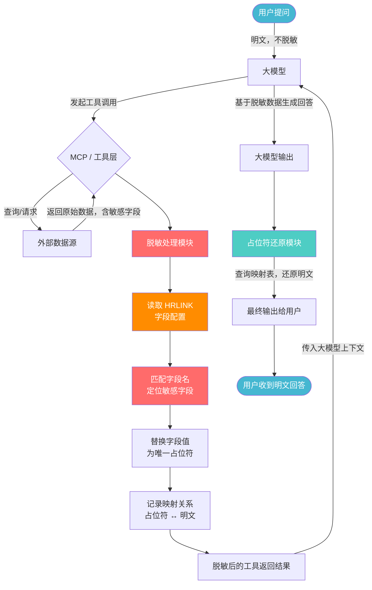
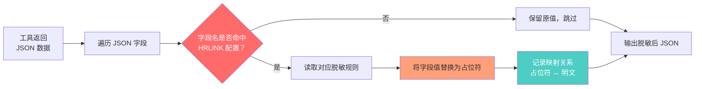
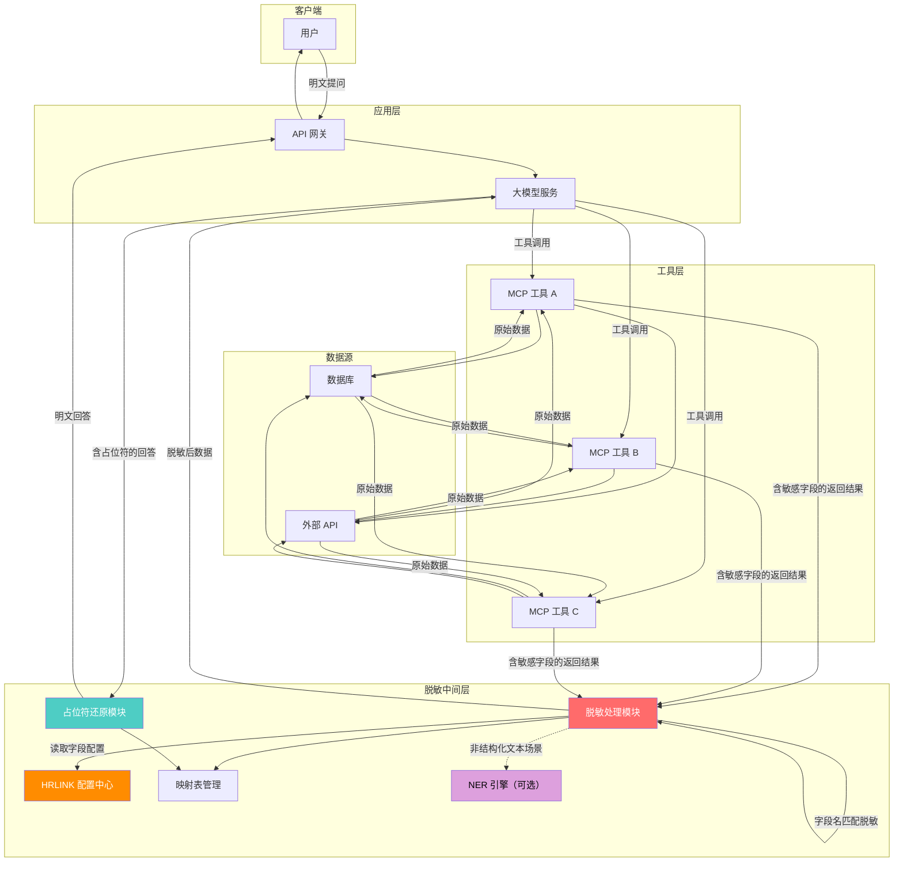

# MCP / 工具调用返回数据脱敏需求方案

## 一、需求背景

在企业级大模型系统对接场景中，用户提问通过大模型触发 MCP / 工具调用（如查询数据库、调用 API 接口），工具返回的结果中往往包含大量敏感数据（如手机号、身份证、姓名、地址等）。这些敏感数据直接进入大模型上下文后，存在数据泄露风险。

**核心诉求**：对 MCP / 工具调用返回的数据进行脱敏处理，确保敏感数据不以明文形式进入大模型上下文。用户提问本身保持明文，不做脱敏处理。

---

## 二、方案说明

**MCP / 工具调用返回数据脱敏**

- 用户提问明文不脱敏，保持自然交互体验。
- 工具返回数据在进入大模型前完成脱敏，确保敏感数据不进入模型上下文。
- 脱敏后的大模型回答通过占位符还原机制，将明文数据返回给用户。

---

## 三、整体流程

### 3.1 流程图



### 3.2 流程说明

| 步骤 | 说明 |
|------|------|
| 1. 用户提问 | 用户以明文方式提问，不做任何脱敏处理 |
| 2. 大模型解析意图 | 大模型理解用户需求，决定调用哪些工具/MCP |
| 3. 工具调用执行 | MCP / 工具层执行调用，从外部数据源获取原始数据 |
| 4. 工具返回原始数据 | 返回结构化数据（JSON），包含敏感字段（手机号、姓名、身份证等） |
| 5. 脱敏处理模块介入 | 在数据进入大模型上下文前，拦截工具返回结果 |
| 6. 读取 HRLINK 配置 | 获取 HRLINK 系统中定义的敏感字段配置及脱敏规则 |
| 7. 匹配字段名 | 将工具返回的字段名与 HRLINK 配置进行匹配，定位敏感字段 |
| 8. 替换字段值为占位符 | 将匹配到的敏感字段值替换为唯一占位符 |
| 9. 记录映射关系 | 保存占位符与明文的双向映射（会话级别） |
| 10. 脱敏数据传入大模型 | 大模型仅看到脱敏后的数据，无法接触敏感明文 |
| 11. 大模型生成回答 | 基于脱敏数据生成包含占位符的回答 |
| 12. 占位符还原 | 根据映射表将占位符还原为明文 |
| 13. 返回用户 | 用户收到完整的明文回答 |

---

## 四、脱敏处理模块详细设计

### 4.1 敏感数据类型

敏感数据类型**来源于 HRLINK 系统的配置**，由 HRLINK 统一管理并下发，脱敏模块根据 HRLINK 的配置动态加载需要脱敏的数据类型，不在本地硬编码。

| 配置项 | 说明 | 示例 |
|--------|------|------|
| 数据类型编码 | HRLINK 中定义的唯一标识 | `PHONE`、`ID_CARD`、`NAME` 等 |
| 数据类型名称 | 可读的中文名称 | 手机号、身份证号、姓名 等 |
| 对应字段名 | 工具返回 JSON 中的字段名 | `phone`、`idCard`、`name` 等 |
| 脱敏策略 | 该类型对应的脱敏方式 | 字段值替换 |
| 占位符前缀 | 脱敏后占位符的类型标识 | `PHONE_001`、`NAME_001` 等 |

**配置管理要求**：

- 脱敏模块启动时从 HRLINK 拉取最新的敏感数据类型配置
- 支持配置热更新：HRLINK 侧新增或修改数据类型后，脱敏模块自动生效，无需重启
- 新增敏感类型时，只需在 HRLINK 系统中配置，无需修改脱敏模块代码

### 4.2 核心脱敏策略：字段配置匹配

工具返回的数据通常为结构化 JSON，字段名是明确的。脱敏模块根据 HRLINK 配置的字段映射，直接对匹配字段的值进行脱敏替换。

#### 脱敏匹配流程



#### 匹配规则示例

假设 HRLINK 配置了以下敏感字段：

| 数据类型编码 | 对应字段名 | 占位符前缀 |
|------------|-----------|-----------|
| `PHONE` | `phone`、`mobile`、`tel` | `PHONE` |
| `ID_CARD` | `idCard`、`idNumber` | `IDCARD` |
| `NAME` | `customerName`、`userName`、`name` | `NAME` |
| `ADDRESS` | `address`、`addr` | `ADDRESS` |

**工具返回原始数据**：
```json
{
  "order_id": "ORD20250611001",
  "customerName": "张三",
  "phone": "13812345678",
  "address": "北京市朝阳区建国路88号",
  "amount": 2999.00
}
```

**匹配 HRLINK 配置后脱敏**：
```json
{
  "order_id": "ORD20250611001",
  "customerName": "NAME_001",
  "phone": "PHONE_001",
  "address": "ADDRESS_001",
  "amount": 2999.00
}
```

#### 为什么采用字段配置匹配？

| 对比维度 | 字段配置匹配 | NER 实体识别 |
|----------|------------|--------------|
| 适用数据 | 结构化 JSON（字段名明确） | 非结构化纯文本 |
| 准确率 | 高，字段名精确匹配 | 存在误识别风险 |
| 性能 | 高，直接字段查找，O(1) | 低，需模型推理 |
| 维护成本 | 低，配置化管理 | 高，需模型训练和调优 |
| 扩展方式 | HRLINK 配置新增字段即可 | 需标注数据、微调模型 |

### 4.3 补充脱敏策略：NER 实体识别（可选）

对于工具返回**非结构化纯文本**（如自由格式的备注、描述、富文本等），无法通过字段名匹配时，可启用 NER 实体识别作为补充手段。

#### 适用场景

- 工具返回字段中包含自由文本字段（如 `remark`、`description`、`note` 等）
- 文本中可能夹杂敏感信息，但无法通过字段名定位

#### 推荐 NER 模型

| 模型 | 特点 | 适用场景 |
|------|------|----------|
| BERT + CRF (中文) | 准确率高，上下文理解强 | 通用场景 |
| HanLP | 开箱即用，实体类型丰富 | 快速集成 |
| JioNLP | 轻量，专注信息抽取 | 资源受限环境 |
| 业务微调模型 | 针对业务数据训练 | 高准确率要求场景 |

> **注意**：NER 仅作为补充手段，核心结构化字段的脱敏仍以 HRLINK 字段配置为准。

### 4.4 占位符设计

占位符格式：`{TYPE}_{唯一ID}`

| 敏感类型 | 占位符示例 | 说明 |
|----------|------------|------|
| 手机号 | `PHONE_001` | 第1个匹配到的手机号 |
| 身份证号 | `IDCARD_001` | 第1个匹配到的身份证号 |
| 姓名 | `NAME_001` | 第1个匹配到的姓名 |
| 邮箱 | `EMAIL_001` | 第1个匹配到的邮箱 |
| 银行卡 | `BANKCARD_001` | 第1个匹配到的银行卡号 |
| 地址 | `ADDRESS_001` | 第1个匹配到的地址 |

**占位符规则**：
- 唯一 ID 在同一会话内递增，保证可还原
- 同一敏感值使用同一占位符，避免冗余
- 映射表仅在会话内有效，会话结束后销毁

---

## 五、映射表管理

### 5.1 映射表结构

```
Session Mapping Table
├── session_id: "session_abc123"
├── mappings:
│   ├── PHONE_001 → "13812345678"
│   ├── NAME_001  → "张三"
│   ├── IDCARD_001 → "110101199001011234"
│   └── ADDRESS_001 → "北京市朝阳区XX路XX号"
├── created_at: "2025-06-11T10:00:00Z"
└── expires_at: "2025-06-11T10:30:00Z"  // 会话过期时间
```

### 5.2 映射表管理规则

| 规则 | 说明 |
|------|------|
| 会话隔离 | 每个用户会话独立维护映射表 |
| 自动过期 | 会话超时后自动销毁映射表 |
| 内存存储 | 映射表仅存于内存，不持久化 |
| 安全清理 | 会话结束后立即清除所有映射 |

---

## 六、脱敏示例

### 6.1 工具调用场景（结构化数据 - 主要场景）

**用户提问（明文）**：
> 帮我查一下张三的订单信息，他手机号是 13812345678

**工具返回原始数据**：
```json
{
  "order_id": "ORD20250611001",
  "customerName": "张三",
  "phone": "13812345678",
  "address": "北京市朝阳区建国路88号",
  "order_amount": 2999.00,
  "status": "已发货"
}
```

**HRLINK 字段配置匹配**：
- `phone` → 命中 `PHONE` 规则 → 替换为 `PHONE_001`
- `customerName` → 命中 `NAME` 规则 → 替换为 `NAME_001`
- `address` → 命中 `ADDRESS` 规则 → 替换为 `ADDRESS_001`
- `order_id`、`order_amount`、`status` → 未命中配置 → 保留原值

**脱敏后传入大模型**：
```json
{
  "order_id": "ORD20250611001",
  "customerName": "NAME_001",
  "phone": "PHONE_001",
  "address": "ADDRESS_001",
  "order_amount": 2999.00,
  "status": "已发货"
}
```

**大模型输出（含占位符）**：
> NAME_001 的订单 ORD20250611001 已发货，订单金额 2999 元，收货地址为 ADDRESS_001，联系电话 PHONE_001。

**还原后输出给用户**：
> 张三的订单 ORD20250611001 已发货，订单金额 2999 元，收货地址为北京市朝阳区建国路88号，联系电话 13812345678。

---

## 七、非功能需求

### 7.1 性能要求

| 指标 | 要求 |
|------|------|
| 脱敏处理延迟 | 单次脱敏 < 10ms（字段配置匹配，无需模型推理） |
| 字段匹配准确率 | 100%（精确字段名匹配，无误差） |
| 映射表查询 | O(1) 时间复杂度 |

### 7.2 安全要求

| 要求 | 说明 |
|------|------|
| 数据不落地 | 映射表仅在内存中，不写入磁盘或日志 |
| 会话隔离 | 不同会话的映射表严格隔离 |
| 安全销毁 | 会话结束后立即清除映射数据 |
| 审计日志 | 脱敏模块的操作日志不记录明文敏感数据 |

### 7.3 可扩展性

| 要求 | 说明 |
|------|------|
| HRLINK 配置热更新 | HRLINK 侧新增/修改字段配置后，脱敏模块自动生效 |
| 多字段别名支持 | 同一数据类型可配置多个字段名（如 `phone`、`mobile`、`tel` 均视为手机号） |
| 多工具适配 | 脱敏模块适配不同类型工具的返回格式（JSON、XML、纯文本等） |
| NER 补充能力 | 对非结构化文本场景，可选启用 NER 实体识别作为补充 |

---

## 八、技术架构总览



---

## 九、实施计划

| 阶段 | 内容 |
|------|------|
| 第一阶段 | HRLINK 字段配置方案设计与对接 |
| 第二阶段 | 脱敏处理模块开发（字段配置匹配） |
| 第三阶段 | 映射表管理与还原模块开发 |
| 第四阶段 | 与现有 MCP / 工具层集成 |
| 第五阶段 | 测试与联调 |
| 第六阶段 | 上线部署与监控 |

---

## 十、总结

本方案聚焦于 **MCP / 工具调用返回数据脱敏** 这一核心环节：

1. **用户提问保持明文**：不影响用户交互体验。
2. **基于 HRLINK 字段配置脱敏**：工具返回的结构化数据，通过字段名与 HRLINK 配置匹配，精准替换敏感字段值为占位符，无需正则或模型推理。
3. **NER 实体识别（可选补充）**：仅针对非结构化文本场景，作为补充手段。
4. **占位符还原**：通过会话级映射表，在最终输出时将占位符还原为明文。
5. **安全保障**：敏感数据全程不进入大模型上下文，映射表内存级管理，会话结束即销毁。
